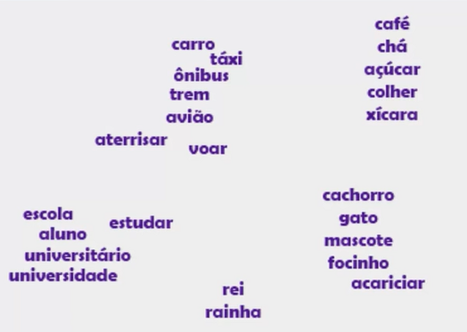
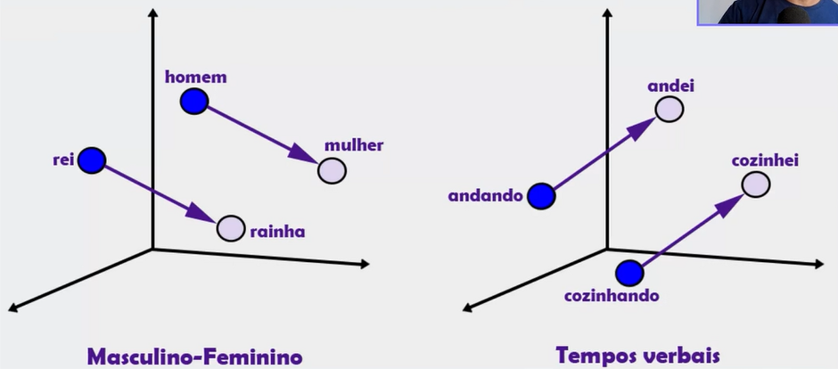
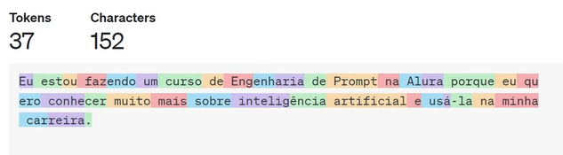

# 🤖 Modelos de Linguagem: Como Funcionam?

Os LLMs (Large Language Models) são modelos treinados com bilhões de palavras 🧠💬. 

Mas o conceito de **modelo de linguagem** vem de antes da IA moderna, baseado em **padrões linguísticos**.

📌 Exemplo:  
"Eu gosto de **pizza**" → sempre que usamos o verbo *gostar*, vem uma preposição como "de". Isso é padrão!  

Os modelos aprendem esses padrões para **prever a próxima palavra**, reconhecendo **relações e estruturas** entre palavras.

---

# 🧠 Word Embeddings

**Word Embeddings** são formas de representar palavras em números (vetores) que mostram **proximidade de significado**.

📍 Exemplo:  
Palavras como "rei" e "rainha" estarão próximas, assim como "gato" e "cachorro".

Eles ajudam a IA a entender **semelhança semântica** (significados parecidos), mesmo que as palavras sejam diferentes.

🖼️  
  

---

# 🕹️ Jogue com a IA

> “Vamos simular o ChatGPT!  
Para cada frase que eu digitar, você responde com as 5 palavras mais prováveis que usaria para completá-la, com suas respectivas probabilidades.  
Apenas palavras e números, sem explicações.”

---

## 🔮 Adivinhando a Próxima Palavra

A IA tenta prever a **próxima palavra a cada passo**, como se estivesse sempre completando uma frase!

🎯 O diferencial? Ela **lembra do que foi dito antes**, mantendo **contexto e coerência** em conversas longas.

Isso permite respostas mais inteligentes e conectadas! 🔗💡

---

# 🌡️ Temperatura: Controlando Criatividade

A **temperatura** define o quão criativa será a resposta da IA:

- 🔵 **Baixa (ex: 0.2)** → Respostas mais objetivas, previsíveis e seguras.
- 🔴 **Alta (ex: 0.8)** → Mais criatividade, variação e até ousadia.

💡 Quanto maior a temperatura, maior a chance da IA **"arriscar"** palavras menos prováveis — ótimo para gerar ideias!

---

# 🔠 Tokens: O Que São?

**Tokens** são pedacinhos de texto que a IA entende — podem ser palavras, partes delas ou símbolos.

🔍 Exemplo:  
"infeliz" → pode virar `in` + `feliz`

Eles impactam:
- 💵 Custo da requisição
- 🕐 Tempo de resposta
- 📏 Limite de caracteres (entrada + saída)

Cada modelo tem seu próprio sistema de **tokenização**.

🖼️  

